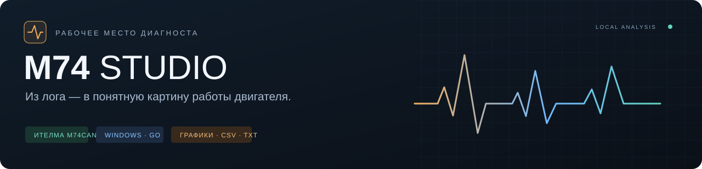
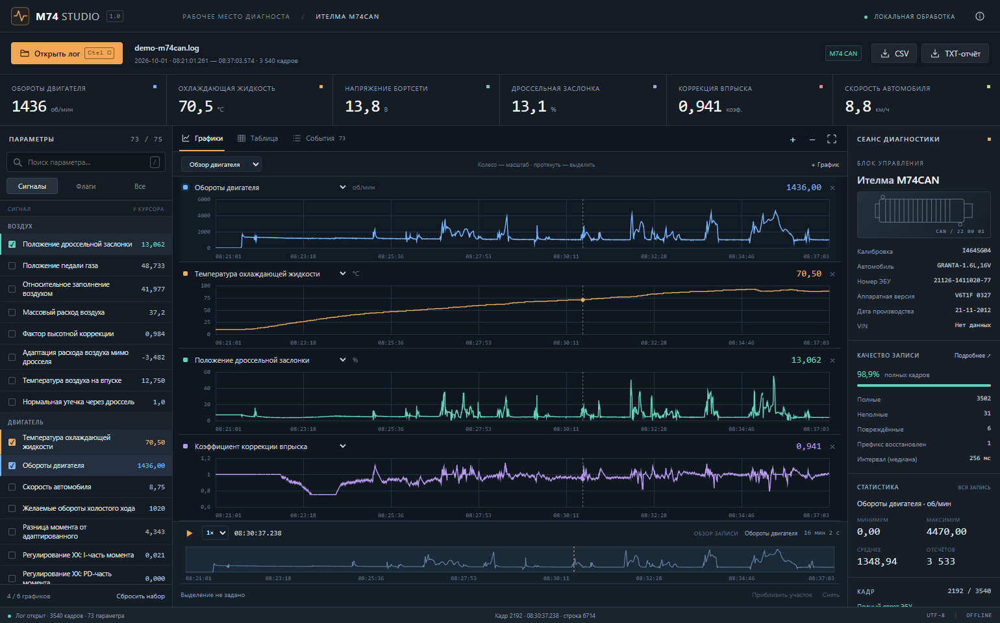
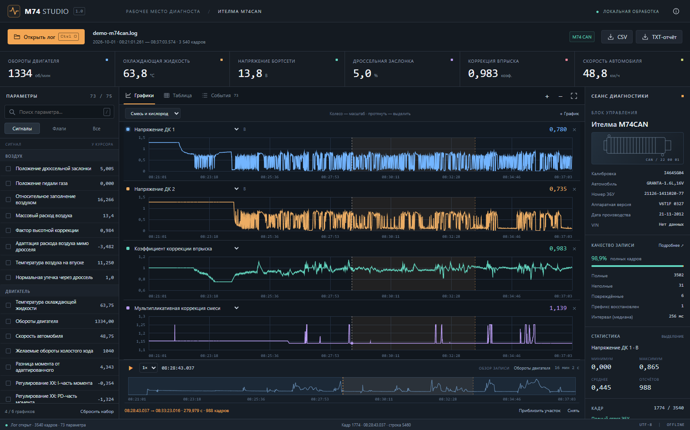
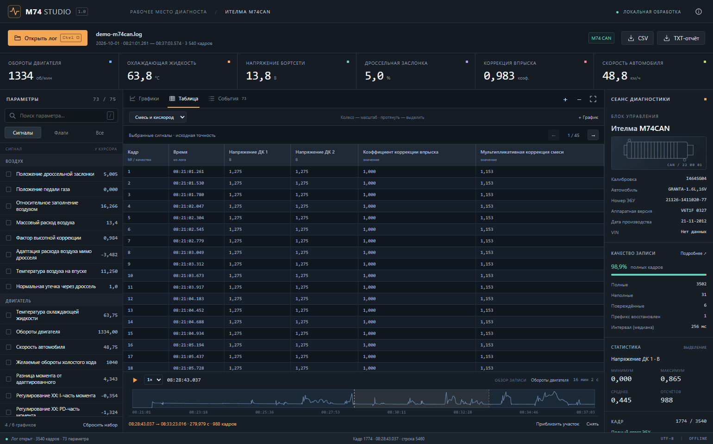
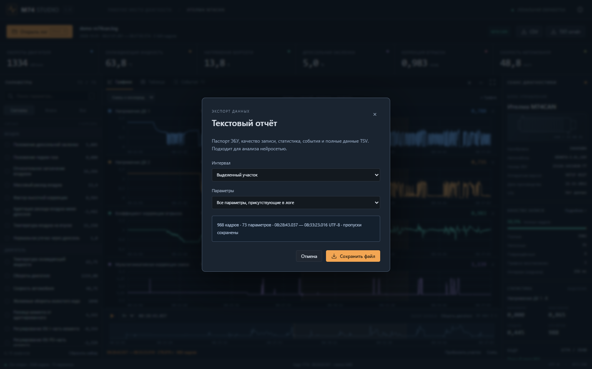

<div align="center">



**Логи OpenDiag → параметры двигателя → синхронные графики → CSV / TXT**

Windows 10/11 x64 · Go · WebView2 · Ителма М74CAN · Работает локально

[Возможности](#возможности) · [Скриншоты](#скриншоты) · [Запуск](#запуск) · [Сборка](#сборка-и-релизы) · [Как устроена расшифровка](m74studio/docs/DECODING.md)

</div>



## Из HEX-пакетов в показания

M74 Studio читает записи OpenDiag Mobile для **Ителма М74CAN** и восстанавливает значения с названиями, единицами измерения и временем. Выберите нужные сигналы, приблизьте участок и сохраните отчёт для дальнейшего анализа — в том числе нейросетью.

| 75 описаний параметров | Графики с прокруткой | 2 формата экспорта |
| :--- | :--- | :--- |
| Числовые значения, служебные поля и флаги. В контрольном логе доступны 73. | Общие курсор и шкала времени. Выделение, масштабирование, воспроизведение. | CSV для таблиц и TXT со словарём параметров, статистикой и полными данными. |

## Возможности

- **Рабочее место диагноста.** Плотный тёмный интерфейс, ключевые показания сверху, сигналы слева, паспорт ЭБУ и статистика справа.
- **Исследование записи.** Готовые наборы сигналов, поиск, синхронные графики, таблица кадров и переход к событиям.
- **Прозрачное качество данных.** Неполные и повреждённые ответы отмечаются явно. Отсутствующие значения сохраняются как пропуски.
- **Экспорт нужного участка.** Вся запись, выделение или видимая область; все параметры или только выбранные графики.
- **Локальная обработка.** Файл обрабатывается на компьютере. Для работы не нужен сервер или доступ к интернету.

## Скриншоты

### Смесь и коррекции

Синхронные показания кислородных датчиков и коррекций впрыска с выделенным участком.



<details>
<summary><strong>Таблица кадров и экспорт отчёта</strong></summary>





</details>

Скриншоты сняты с интерфейса приложения на расшифрованной контрольной записи; имя файла заменено на `demo-m74can.log`. Это реальные графики, не макеты. Исходный лог и полные экспорты в репозиторий не входят.

## Запуск

1. Скачайте `M74Studio-windows-x64.zip` из **Releases** после первого опубликованного тега. Промежуточные сборки доступны в **Actions → Windows build & release → Artifacts**.
2. Распакуйте ZIP и запустите **M74Studio.exe**.
3. Нажмите **Открыть лог** или перетащите `.log` в окно.

Нужны Windows 10/11 x64 и [Microsoft Edge WebView2 Runtime](https://developer.microsoft.com/microsoft-edge/webview2/). Установка Go или Node.js для запуска не требуется.

| Действие | Управление |
| :--- | :--- |
| Открыть / экспортировать CSV | `Ctrl+O` / `Ctrl+E` |
| Приблизить / сдвинуть время | Колесо на нижней панели / `Shift` + колесо |
| Выделить / приблизить участок | Протянуть мышью по графику / «Приблизить участок» на нижней панели |
| Перейти к кадру / воспроизвести | `←` `→` / `Пробел` |
| Показать всю запись | Двойной щелчок по графику |

Подробная [инструкция пользователя](m74studio/README.md).

## Сборка и релизы

Нужны **Go 1.26.1+**, **MinGW-w64 / GCC** и **windres** в `PATH`.

```powershell
cd m74studio
powershell -NoProfile -ExecutionPolicy Bypass -File .\build.ps1
powershell -NoProfile -ExecutionPolicy Bypass -File .\scripts\check-cli.ps1
powershell -NoProfile -ExecutionPolicy Bypass -File .\scripts\package.ps1
```

Сборка выполняет `go test ./...`, `go vet ./...` и создаёт `M74Studio.exe`. Упаковка создаёт `dist/M74Studio-windows-x64.zip` и `SHA256SUMS.txt`.

**GitHub Actions:** push в `main`, pull request и ручной запуск выполняют проверки и сборку на Windows. Тег вида `v1.1.0` после успешной сборки публикует Release с ZIP и контрольной суммой. Персональные токены для пайплайна не нужны.

```powershell
git tag v1.1.0
git push origin v1.1.0
```

Порядок первой публикации и устройство пайплайна: [GITHUB.md](m74studio/docs/GITHUB.md).

## Точность и поддержка

Декодер проверяется на контрольных пакетах и тестовой записи: **3540 кадров**, длительность **16 мин 02 с**, медианный интервал — **256 мс**. Подробности — [формат и формулы](m74studio/docs/DECODING.md) и [проверки](m74studio/docs/VALIDATION.md).

Поддерживаются основной пакет **М74CAN** `220001` и общие параметры p001–p010 пакета `220002`; смешанные записи читаются целиком. М74 без CAN, М74CAN MAP, другие ЭБУ, сравнение записей, дополнительные группы АЦП/детонации/пропусков и расшифровка кодов DTC пока не реализованы. Программа анализирует файлы и не подключается к автомобилю.

## Структура репозитория

```text
.github/workflows/windows.yml   Проверки, Windows-сборка и Release
m74studio/
  internal/decoder/             Парсер, профиль М74CAN, экспорт и тесты
  ui/                           Интерфейс и Canvas-графики
  docs/images/                  Баннер и скриншоты
  scripts/                      Проверка CLI, упаковка, скриншоты
  main.go                       Приложение и интерфейс командной строки
  native_windows.go             Окно и системные диалоги
  build.ps1                     Воспроизводимая команда сборки
```

Локальные инструменты, логи, отчёты и собранные EXE исключены через `.gitignore`. [Сторонние компоненты и их лицензии](m74studio/THIRD_PARTY.md).
